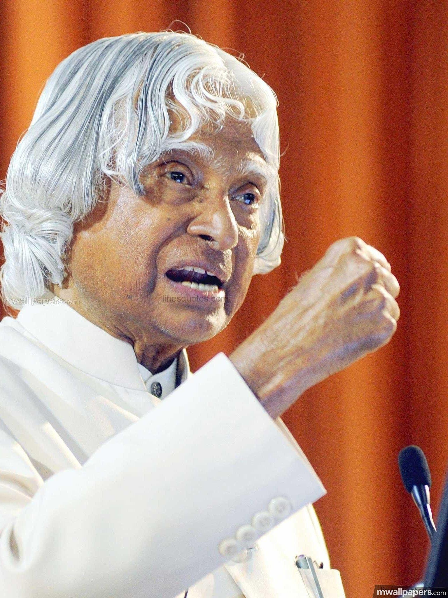

# Tribute Page

A simple tribute page dedicated to Dr. A. P. J. Abdul Kalam, the Missile Man of India and the 11th President of India.

This project was built using only HTML and CSS to practice semantic HTML, page layouts, typography, spacing, and responsive design.

---

## Features

- Hero section with image and introduction
- Biography section
- Timeline of important milestones
- Inspirational quote section
- Clean footer
- Responsive layout
- Semantic HTML structure

---

## Technologies Used

- HTML5
- CSS3

---

## What I Practiced

- Semantic HTML
- Flexbox
- Typography
- CSS Box Model
- Spacing and Alignment
- Responsive Design
- Card Layout
- Color Palette
- Clean UI Design

---

## Project Structure

```
tribute-page/
│
├── images/
├── index.html
├── style.css
└── README.md
```

---

## Screenshot

## 📸 Screenshot



---

## Learning Outcome

While building this project, I learned how to:

- Structure a webpage using semantic HTML
- Create responsive layouts with CSS
- Improve readability using proper spacing and typography
- Design clean and consistent UI components
- Organize content into meaningful sections

---

## Author

->Riya Gupta

->GitHub: https://github.com/riya123-jpg
